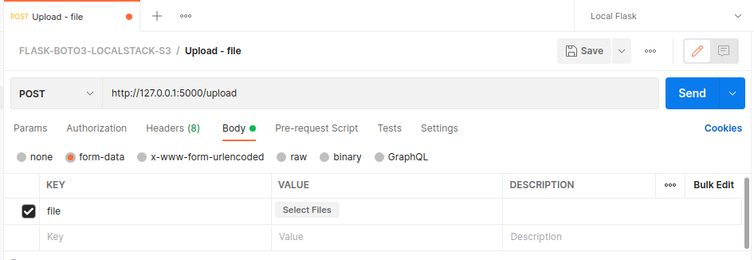
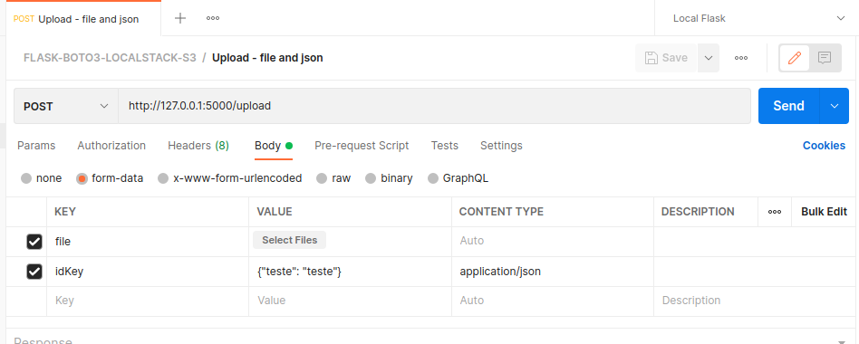
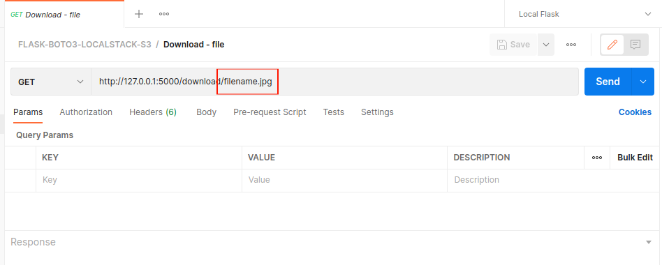

# FLASK-BOTO3-LOCALSTACK-S3
## Integração utilizando Flask, Boto3 e LocalStack, para realizar upload e download de arquivo no S3.

Código em python utilizando [Flask](https://flask.palletsprojects.com/en/2.1.x/) e [Boto3](https://pypi.org/project/boto3/) para fazer conexão com o [LocalStack S3](https://localstack.cloud/) e realizar o upload e download de arquivos através de requisições REST utilizando o [Postman](https://www.postman.com/).

---
### **Requisitos**
- [Docker](https://www.docker.com/)
- [Postman](https://www.postman.com/)
---
### **Inicializando**
1. Clone o repositório
2. Na raiz do repositório execute o comando `docker-compose up -d`
3. Crie no localstacke o bucket `bucket-teste`
4. Importe o arquivo `FLASK-BOTO3-LOCALSTACK-S3.postman_collection.json` no postman
5. Realize a requisição mais adequada a sua situação no postman (Upload - file / Upload - file and json / Download - file)

---
### **Criando o bucket**
O bucket pode ser criado por qualquer método preferível como:
 - `awslocal`
 - `awscli`
 - `LocalStack Web App`
 - `Ou por qualquer outro método.`

Todas as informações sobre os métodos citados acima podem ser encontradas no próprio site do [LocalStack](https://localstack.cloud/).

Caso queira criar o bucket com um nome diferente deve se modificar a linha 33 do arquivo `docker-compose.yml` para que fique com o mesmo nome do bucket que sera criado.

---
### **Variáveis de ambiente do docker-compose.yml**
`AWS_ACCESS_KEY_ID` e `AWS_SECRET_ACCESS_KEY`  são obrigatórios pois o localstack valida se elas estão sendo passados, mas não valida os valoreis delas.

Portanto pode se passar qualquer valor para essas duas variáveis que eles serão aceitos. 
```
AWS_ACCESS_KEY_ID: teste123
AWS_SECRET_ACCESS_KEY: teste123
```
---

`BUCKET_NAME` especifica o nome do bucket onde sera salvo o arquivo de upload e de onde sera realizado o download.

Caso queira utilizar um bucket com nome diferente deve alterar o nome do buckets nesta variável.
```
BUCKET_NAME: bucket-teste
```
---
`AWS_URL` especifica a url do localstack, como esta sendo passado através do docker-compose deve ser passado no formato `http:// + nome_do_container_do_localstack + :4566`.
Caso seja passado fora do docker-compose deve ser passado o valor `http://localhost:4566`
```
AWS_URL: http://localstack:4566
```
---
### **Requisições Postman**
A collection postman disponibilizada possui 3 operações.
- Upload - file
- Upload - file and json
- Download - file

#### **POST Upload - file**
Recebe como parâmetro somente o arquivo a ser enviado para o S3.


#### **POST Upload - file and json**
Recebe como parâmetros o arquivo a ser enviado para o S3 e um json.


Para adicionar o campo `CONTENT TYPE` utilize os 3 pontos que fica ao lado de `DESCRIPTION`


#### **GET Download - file**
Recebe como path parâmetro o nome do arquivo a ser baixado do S3.

Para utilizar a operação de download é necessário que o arquivo passado como paramento exista no S3.
